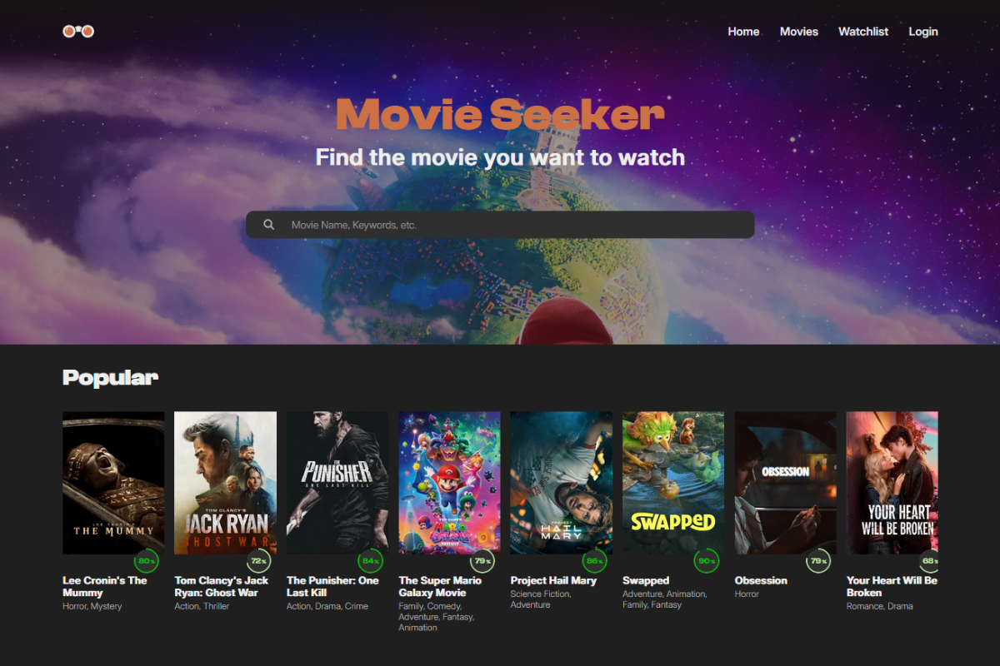

# Movie Seeker

[]

Movie Seeker is a PHP-based web application that allows users to discover movies using the TMDB (The Movie Database) API. Users can create an account, log in, and curate their own personal watchlist of favorite movies. The application is fully containerized using Docker for easy setup and deployment.

## Features
- **Movie Search:** Search for any movie using the extensive TMDB API.
- **User Authentication:** Secure user registration and login system.
- **Personal Watchlist:** Logged-in users can add and remove movies from their watchlist.
- **Dockerized Environment:** Quick and consistent setup across different environments using Docker.

## Prerequisites
Before you begin, ensure you have met the following requirements:
- **Docker** and **Docker Compose** installed on your machine.
- A **TMDB API Key**. You can get one by registering at [The Movie Database](https://www.themoviedb.org/documentation/api).

## Setup and Installation

1. Clone the repository:
   git clone https://github.com/yourusername/movie-seeker.git
   cd movie-seeker

2. Configure Environment Variables:
   Create a `.env` file in the root directory (or copy from `.env.example` if available) and add your TMDB API key and database credentials:
   
   TMDB_API_KEY=your_api_key_here
   DB_HOST=db
   DB_NAME=movieseeker
   DB_USER=root
   DB_PASS=secret

3. Build and run the Docker containers:
   docker-compose up -d --build

4. Access the application:
   Open your web browser and navigate to `http://localhost`.

## Usage
- **Search:** Use the search bar on the homepage to find movies.
- **Register/Login:** Create an account to access watchlist features.
- **Watchlist:** Click the "Add to Watchlist" button on any movie card or details page to save it to your account.